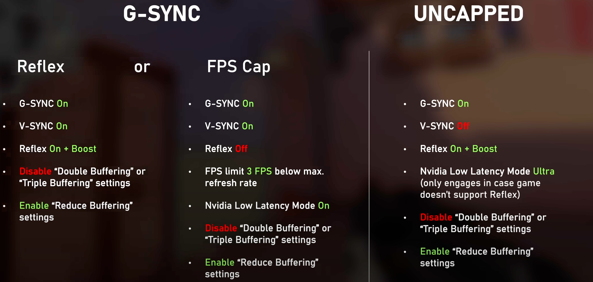
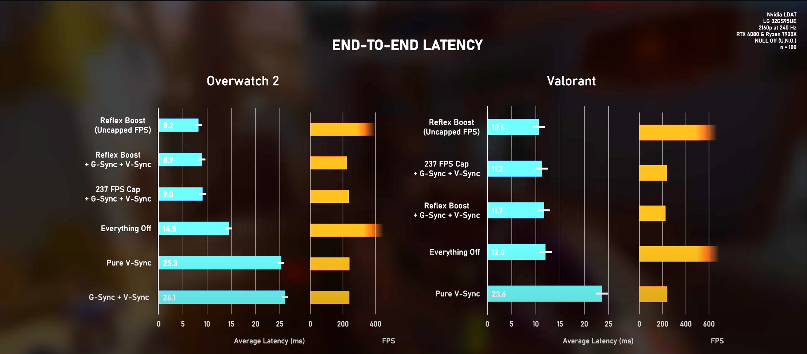
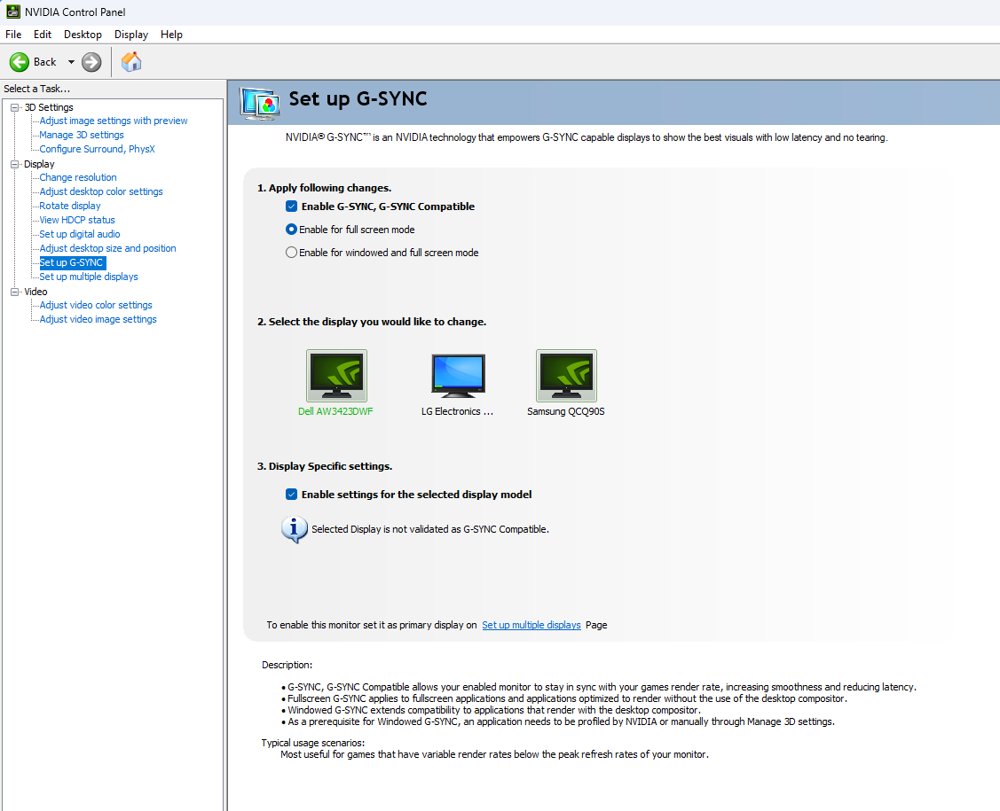
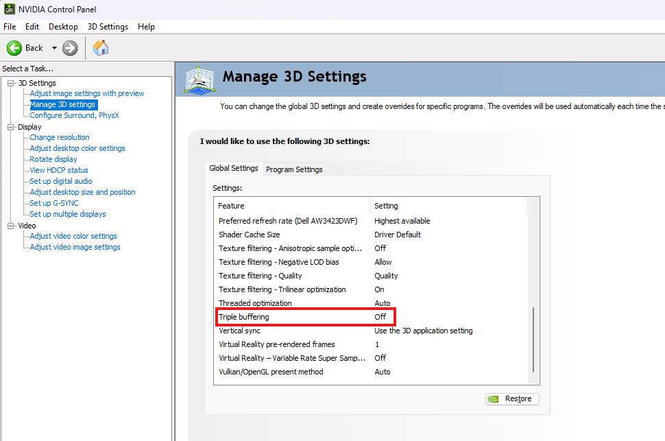
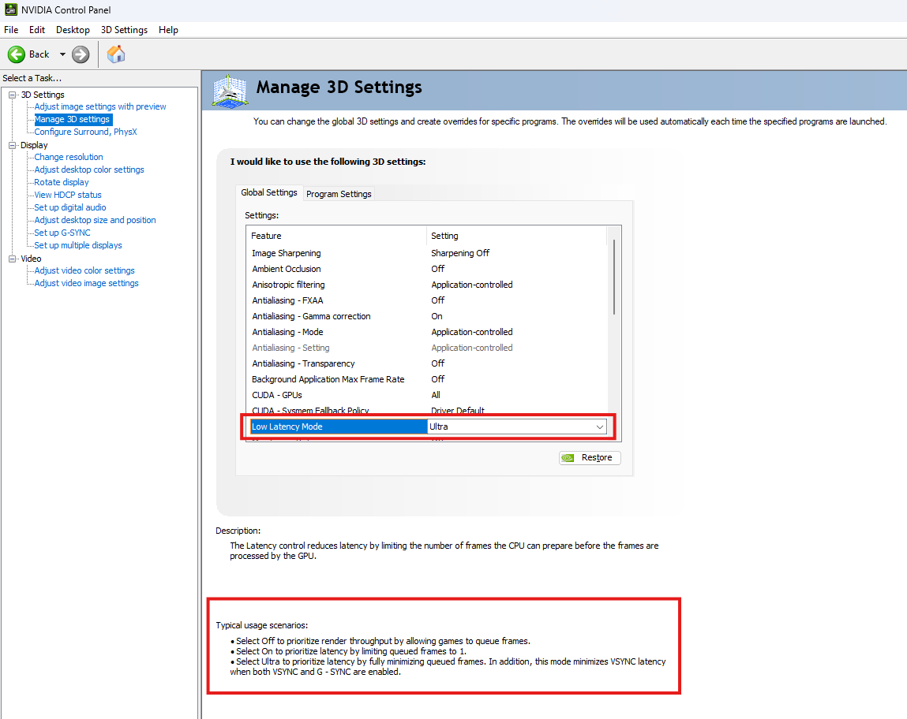
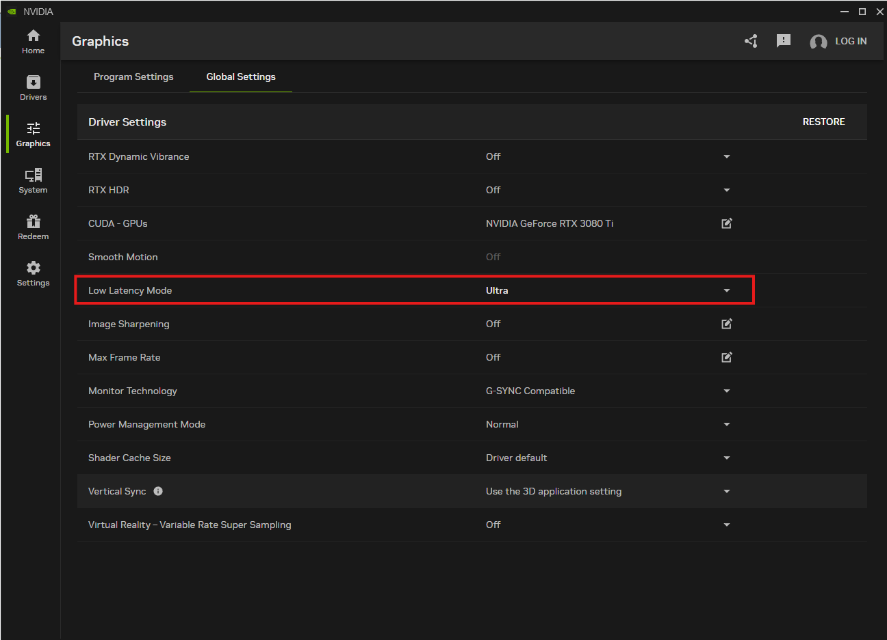

---
tags:
  - windows
  - win11
---
## Summary

System Settings:

- [Enable G-Sync](#enable%20g-sync)
- [Disable Double/Triple Buffering](#disable%20double/triple%20buffering)
- [Enable Low Latency Mode](#enable%20low%20latency%20mode)

Game Settings:

If the game supports Reflex:

- Enable **V-Sync** (set in-game)
- Enable **Reflex On+Boost** (set in-game)

If not:

- Disable **V-Sync** (set in-game)

## Optimal G-Sync/Free-Sync Configuration

https://www.youtube.com/watch?v=5mWMP96UdGU

## Enable G-Sync

1. Enable on physical monitor using on-screen controls (differs per brand; look around or look it up by brand).
2. Open NVIDIA Control Panel -> 3D Settings -> Display -> Set up G-Sync
3. Set per display

## Disable Double/Triple Buffering

This setting is disabled by default.

1. Open NVIDIA Control Panel -> 3D Settings -> Global Settings
2. **Set Triple Buffering to Off**

## Enable Low Latency Mode 

This setting is off by default.

1. Open NVIDIA Control Panel -> 3D Settings -> Global Settings
2. **Low Latency Mode to Ultra**

3. The NVIDIA App also has this setting (duplicate? Not sure of precedence order).

